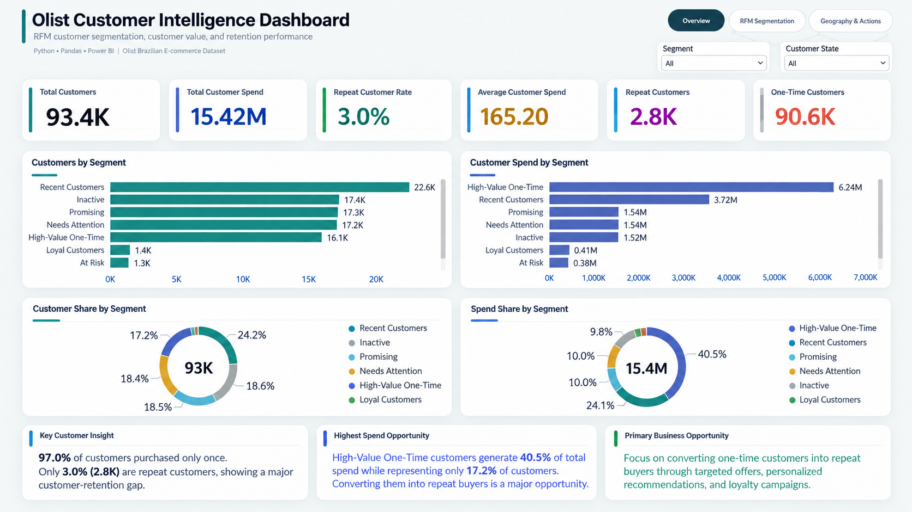
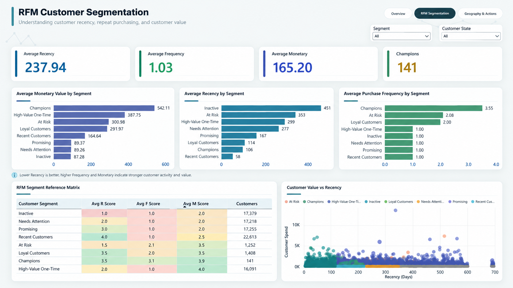

# Olist Customer Intelligence & RFM Analysis

An end-to-end customer analytics project using **Python, Pandas, RFM Analysis, Power BI, and DAX** to understand purchasing behavior, identify valuable customer segments, and translate transactional data into actionable retention strategies.

## Project Overview

The goal of this project was to understand customer purchasing behavior in the Olist Brazilian E-Commerce dataset and answer a key business question:

> **Which customers should the business retain, re-engage, or convert into repeat buyers?**

The analysis started with 9 raw CSV files containing customer, order, payment, product, seller, review, and geographic data.

Python and Pandas were used for data preparation and customer-level analysis. RFM (Recency, Frequency, Monetary) analysis was then used to segment customers based on purchasing behavior.

The final results were presented through a 3-page interactive Power BI dashboard.

## Key Findings

- **93,357 customers** were included in the final RFM analysis.
- Only **3.0%** of customers made more than one delivered purchase.
- Approximately **90.6K customers** were one-time buyers.
- **High-Value One-Time customers represented 17.2% of customers but contributed 40.5% of customer spend.**
- The analysis identified **8 customer segments**, each with a different recommended business action.

These findings suggest that treating all one-time customers equally would hide an important opportunity: high-value first-time buyers may be particularly useful candidates for second-purchase and loyalty campaigns.

## Analytical Workflow

```text
9 Raw CSV Files
       ↓
Data Cleaning & Validation
       ↓
Customer + Order + Payment Integration
       ↓
Delivered Order Filtering
       ↓
Order-Level Payment Aggregation
       ↓
Customer-Level RFM Metrics
       ↓
RFM Scoring
       ↓
Customer Segmentation
       ↓
Business Action Mapping
       ↓
Power BI Dashboard
```

## Data Preparation

The analysis was performed in Python using Pandas.

Key preparation steps included:

- Loaded and inspected the original Olist datasets.
- Checked row counts, data types, duplicates, and missing values.
- Filtered the transactional analysis to delivered orders.
- Aggregated multiple payment records belonging to the same order.
- Connected customer, order, payment, and geographic information.
- Aggregated transactions to the unique-customer level.
- Validated customer counts and RFM outputs before dashboard development.
- Exported the processed customer-level dataset for Power BI.

## RFM Methodology

RFM analysis evaluates customers using three dimensions:

### Recency

Measures how recently a customer made a purchase.

A lower number of days represents a more recent customer.

### Frequency

Measures the number of delivered purchases made by a customer.

Because the dataset is strongly concentrated around one-time buyers, frequency scoring was adapted to the observed purchase distribution rather than relying only on standard quartiles.

### Monetary

Measures the total payment value associated with a customer's delivered purchases.

RFM scores were then used to group customers into meaningful behavioral segments.

## Customer Segments

The final model contains eight customer segments:

| Segment | Business Interpretation |
|---|---|
| Champions | Highly engaged customers with strong repeat and value behavior |
| Loyal Customers | Repeat customers with good recent purchasing behavior |
| Recent Customers | Customers who purchased recently but have not yet repeated |
| High-Value One-Time | One-time customers with relatively high spending |
| Promising | Customers with potential for another purchase |
| Needs Attention | Customers whose purchasing activity is becoming less recent |
| At Risk | Valuable/repeat customers who have not purchased recently |
| Inactive | One-time customers with a long period since their purchase |

## Power BI Dashboard

The Power BI report contains three pages.

### 1. Executive Overview

Provides a high-level view of:

- Total customers
- Repeat customer rate
- One-time customers
- Average customer spend
- Customer distribution by segment
- Customer share versus spend share
- Key retention opportunity



### 2. RFM Customer Segmentation

Explores:

- Recency
- Frequency
- Monetary value
- Customer distribution across RFM segments
- Segment-level spending behavior
- High-value and at-risk customer groups



### 3. Customer Geography & Recommended Actions

Connects segmentation with business action through:

- Customer distribution across Brazilian states
- Leading states by customer count
- Segment-specific recommended actions
- Geographic and behavioral filtering


## Business Recommendations

### Convert High-Value One-Time Customers

High-Value One-Time customers account for a disproportionate share of customer spend despite purchasing only once.

Potential actions include:

- Personalized second-purchase offers
- Product recommendations
- Loyalty incentives
- Post-purchase engagement campaigns

### Protect Valuable Repeat Customers

Champions and Loyal Customers should receive retention-focused treatment such as loyalty benefits, exclusive offers, and personalized engagement.

### Re-engage At-Risk Customers

Previously valuable customers whose purchases are becoming less recent can be targeted through focused win-back campaigns.

### Nurture Recent and Promising Customers

Recent first-time buyers can be encouraged toward a second purchase before they move toward inactivity.

## Tools & Technologies

| Tool | Usage |
|---|---|
| Python | Data analysis and transformation |
| Pandas | Cleaning, joining, aggregation and RFM calculations |
| Jupyter Notebook | Analysis and documentation |
| Power BI | Interactive dashboard development |
| DAX | Measures and dashboard calculations |
| RFM Analysis | Customer behavioral segmentation |

## Repository Structure

```text
olist-customer-intelligence-rfm/
│
├── Data/
│   ├── raw/
│   └── processed/
│
├── notebooks/
│   └── 01_customer_segmentation_analysis.ipynb
│
├── dashboard/
│   └── Olist_Customer_Intelligence_Dashboard.pbix
│
├── presentation/
│   ├── Olist_Customer_Intelligence_RFM_Analysis.pptx
│   └── Olist_Customer_Intelligence_RFM_Analysis.pdf
│
├── reports/
│   └── dashboard_screenshots/
│       ├── 01_executive_overview.png
│       ├── 02_rfm_customer_segmentation.png
│       └── 03_geography_actions.png
│
├── docs/
│   └── data_dictionary.md
│
├── .gitignore
└── README.md
```

## How to Run the Project

1. Download the required Olist datasets.
2. Place the raw CSV files inside `Data/raw/`.
3. Open the Jupyter notebook:

```text
notebooks/01_customer_segmentation_analysis.ipynb
```

4. Run the notebook from top to bottom.
5. The processed customer segmentation dataset is generated for use in Power BI.
6. Open the `.pbix` file in the `dashboard/` folder to explore the interactive report.

## Dataset

This project uses the public **Brazilian E-Commerce Public Dataset by Olist**.

The dataset contains anonymized information about orders made through the Olist marketplace, including customers, orders, payments, products, sellers, reviews, and geographic information.

## Notes & Limitations

- The analysis focuses on delivered orders.
- Repeat behavior refers to multiple delivered purchases observed within the available dataset period.
- A one-time buyer should not automatically be interpreted as a churned customer.
- Customer spend is based on available payment records and should not automatically be interpreted as company profit.
- Geographic information represents locations available in the dataset and should not be interpreted as a customer's current location.
- RFM segmentation rules were designed around the purchasing distribution observed in this dataset.

---

### Project Focus

**Raw transactional data → customer behavior → segmentation → business action**

This project was built to demonstrate an end-to-end data analyst workflow: data preparation, validation, behavioral analysis, visualization, and business interpretation.